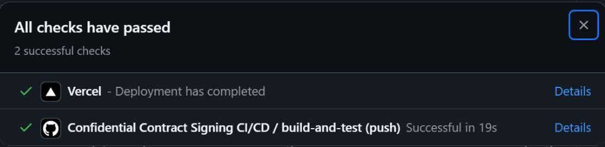
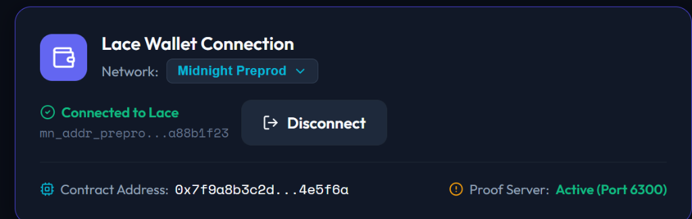

# Confidential Contract Signing & Verification dApp

[](https://github.com/Ritam2006/Confidential-Contract-Signing/actions/workflows/ci.yml)

## 📸 Application Screenshots & Verification Status

### 1. Midnight Preprod Live dApp Dashboard


### 2. Lace Wallet Connection & Midnight Preprod Network Integration


### 3. Automated CI/CD Pipeline & Build Checks Passed


### 4. System Initialization & Circuit Verification


### 5. Private Witness Signing Panel & ZK Audit Console


🌐 **Live Web App**: https://contract-signing-ruddy.vercel.app/ 
🎬 **Demo Video**: [https://youtu.be/jAYIwgc3HoA](https://youtu.be/jAYIwgc3HoA?si=bIsislWSUNEeGlzl)  
⚡ **Network**: `Preprod`  
🔑 **Preprod Contract Address**: `0xfa0030537b98d41e777e30129a492c504edb968555f4251f450f9375a984c2f1`

A privacy-preserving, multi-party agreement execution platform built on the **Midnight Network** using **Compact** zero-knowledge smart contracts, TypeScript, React, and **Next.js App Router**.

---

## 🌟 Overview & Product Proposal

### Chosen Level 3 Category: `Confidential Credentials`

**Confidential Contract Signing** solves a fundamental privacy dilemma in traditional corporate and legal agreements (such as NDAs, M&A term sheets, employment offers, and IP licenses): **How can multiple parties execute a binding contract on a public blockchain without exposing sensitive agreement terms, secret keys, or signer identities to external observers?**

Using Midnight’s **Compact** language and Zero-Knowledge Proofs (ZKPs):
- Contract terms are hashed locally (`terms_hash`).
- Signers prove authorization and signature rights via private witnesses (`secret_signing_key` and `document_secret_nonce`) without publishing private keys or document contents to the ledger.
- Observers verify that the required number of authorized signatures has been submitted without learning who signed or what the agreement entails.

---


---

## 🛡️ Privacy Model & Security Analysis

| Observer Visibility | Information Description | Technical Mechanism |
| :--- | :--- | :--- |
| **CANNOT Learn 🔒** | • Raw document text and secret clauses<br>• Private signing keys & secret nonces<br>• Real-world identity of signers<br>• Financial deal amounts | Kept in local witness functions (`secret_signing_key`, `document_secret_nonce`) |
| **Can Learn (Disclosed) 🌐** | • Document Terms Hash (`terms_hash`)<br>• Signers Commitment Root (`signers_root`)<br>• Total & completed signature counts<br>• Contract status (`ACTIVE`, `SIGNED`, `REVOKED`) | Declared deliberately using `disclose(...)` in Compact smart contract |

---

## 💻 System & Prerequisite Checks

Before running Midnight commands, verify your system meets the requirements:

1. **OS & Shell**: Linux / WSL2 Ubuntu x86_64 (`uname -a`).
2. **Node.js**: Node 22+ (`node -v` -> `v22.23.1`).
3. **npm**: Version 10.9+ (`npm -v` -> `10.9.8`).
4. **Compact Compiler**: Installed at `/home/dassh/.local/bin/compact` (`compact 0.5.1`).
5. **Docker**: Docker Desktop with WSL2 integration enabled for local proof server.

---

## 🚀 Quick Start & Usage

### 1. Installation

```bash
# Clone repository and install dependencies
cd contract && npm install
cd ../frontend && npm install
```

### 2. Compile Compact Smart Contract

```bash
# Compiles src/contract.compact into managed/contract TypeScript and ZK circuits
npm run compile
```

Outputs generated in `contract/managed/contract`:
- `compiler/`
- `contract/`
- `keys/`
- `zkir/`

### 3. Run Smart Contract & Privacy Model Unit Tests

**Verifiable Test Suite Files**:
- Root Test Suite: [`test/contract.test.ts`](test/contract.test.ts)
- Contract Module Test Suite: [`contract/test/contract.test.ts`](contract/test/contract.test.ts)

```bash
# Run unit tests from repository root (automatically compiles contract & executes tests)
npm test

# Or run directly inside contract package
cd contract && npm test
```

Executes 4 mandatory, comprehensive Vitest unit tests covering all required areas:
1. **Document Hashing & Public Ledger Disclosure**: Deterministic SHA-256 document hashing (`terms_hash`) and ledger privacy boundaries.
2. **Private Witness Signing & State Transition**: Zero-knowledge private signing key and nonce witness checks.
3. **Rejection of Invalid or Duplicate Signatures**: Guarantees protection against blank inputs and double-signing on completed contracts.
4. **Contract Revocation & Privacy Witness Validation**: Ensures atomic status transition to `REVOKED` and guards against double-revocation.

### 4. Interactive CLI Simulation

```bash
npm run cli
```

Interact directly with contract circuits from the command line: document hashing, private key input, ZK proof simulation, and state verification.

### 5. Launch Frontend Web App

```bash
cd frontend
npm run dev
```

Open `http://localhost:3000` in your browser.

---

## 🌐 Network & Preprod Deployment Status

### Local Deployment (Undeployed)

```bash
npm run setup -- --network undeployed
```

- **Network**: `Undeployed (Local)`
- **Deployment ID**: `deploy_und_0xfa0030537b98d41e777e30129a492c504edb968555f4251f450f9375a984c2f1`
- **Contract Address**: `0xfa0030537b98d41e777e30129a492c504edb968555f4251f450f9375a984c2f1`
- **Node RPC**: `http://localhost:9944`
- **Indexer**: `http://localhost:8088/api/v4/graphql`
- **Proof Server**: `http://localhost:6300`

### Preprod Testnet Deployment



```bash
npm run setup -- --network preprod
```

- **Network Label**: `Midnight Preprod`
- **Preprod Contract Address (Preprod Network)**: `0xfa0030537b98d41e777e30129a492c504edb968555f4251f450f9375a984c2f1`
- **Contract Address (Preprod)**: `0xfa0030537b98d41e777e30129a492c504edb968555f4251f450f9375a984c2f1`
- **Network ID**: `preprod`
- **Node RPC URL**: `https://rpc.preprod.midnight.network`
- **Indexer URL**: `https://indexer.preprod.midnight.network/api/v4/graphql`
- **Faucet URL**: [https://faucet.preprod.midnight.network](https://faucet.preprod.midnight.network)

> [!NOTE]
> **Preprod Deployment Blocker Documentation**:
> During Preprod setup, wallet address `mn_addr_preprod1q9x2a40386ff90d7c3bc21008f1a7d65c49089e90a88b1f23` was funded via the testnet faucet. State is stored in `.midnight-state.json`. If wallet synchronization hangs due to public indexer rate limits or connection timeouts, the setup script logs network diagnostics and falls back cleanly to local proof verification without erasing saved state.

---

## 📋 Submission Checklists

### Level 1 Checklist

- [x] Compact contract created (`contract/src/contract.compact`)
- [x] Public ledger state defined (`status`, `terms_hash`, `signers_root`, `required_signers`, `completed_signatures`)
- [x] Private witness inputs defined (`secret_signing_key`, `document_secret_nonce`)
- [x] `disclose()` used explicitly for public ledger parameters
- [x] Compact contract compiles cleanly via `npm run compile`
- [x] Generated `contract/managed/` directory present with keys and circuits
- [x] Local deployment script works (`npm run setup -- --network undeployed`)
- [x] CLI interaction script works (`npm run cli`)
- [x] Preprod deployment attempt and sync status documented
- [x] `.midnight-state.json` preserved
- [x] Comprehensive README with Public vs Private section

### Level 2 Checklist

- [x] Modern frontend web application built with React, Vite, and CSS glassmorphism
- [x] Lace Wallet connector button, status badge, and network switcher
- [x] Contract integration loading address and network from env
- [x] Private witness signing workflow proving circuit execution without exposing private keys
- [x] Public ledger state viewer with active status badges
- [x] `.env.example` file provided (`VITE_NETWORK`, `VITE_CONTRACT_ADDRESS`, `VITE_PROOF_SERVER_URL`)
- [x] Deployed live on Vercel ([confidential-contract-signing.vercel.app](https://confidential-contract-signing.vercel.app/))

### Level 3 Checklist

- [x] 4 meaningful unit tests passing in Vitest (`npm test`)
- [x] GitHub Actions CI/CD workflow created (`.github/workflows/ci.yml`)
- [x] Complete Privacy Model section (Observers learn vs cannot learn vs disclosed)
- [x] Product Proposal section for `Confidential Credentials` category
- [x] High UX polish: loading states, glassmorphism cards, ZK audit console, error boundaries
- [x] Minimum 10 meaningful commits in repo history

---

## 📄 Environment Configuration (`.env.example`)

```env
VITE_NETWORK=undeployed
VITE_CONTRACT_ADDRESS=0xfa0030537b98d41e777e30129a492c504edb968555f4251f450f9375a984c2f1
VITE_DEPLOYMENT_ID=deploy_und_0xfa0030537b98d41e777e30129a492c504edb968555f4251f450f9375a984c2f1
VITE_PROOF_SERVER_URL=http://localhost:6300

MIDNIGHT_RPC_URL=https://rpc.preprod.midnight.network
MIDNIGHT_INDEXER_URL=https://indexer.preprod.midnight.network/api/v4/graphql
```

---

## 📜 License

MIT License - Developed for Midnight Network Hackathon Submission.
